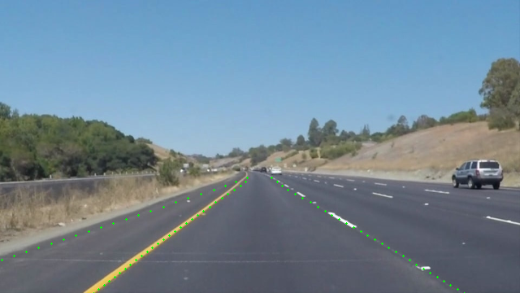

# ROS_LaneATT

This repository creates a TensorRT engine of [LaneATT](https://github.com/lucastabelini/LaneATT) for inference in ROS.

## 0.Prerequisites
- TensorRT 8.0.1 GA
- CUDA 10.2 (Additional patching required)
- See [install](https://github.com/lucastabelini/LaneATT#2-install)

## 1.ONNX
```
git clone https://github.com/lucastabelini/LaneATT.git
git clone https://github.com/Yibin122/TensorRT-LaneATT.git
cd LaneATT
python laneatt_to_onnx.py
```

## 2.TensorRT(C++/ROS  Inference)
```
git clone https://github.com/ChenZjut/ROS_LaneATT.git
cd ROS_LaneATT
catkin_make
roslaunch laneatt laneatt.launch
```




## 3.Reference

https://github.com/Yibin122/TensorRT-LaneATT

## TODO
- [x] C++ inference
- [x] Measure speed on Orin (100 FPS)
